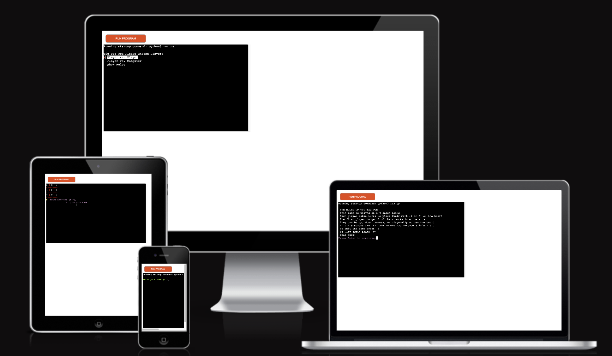
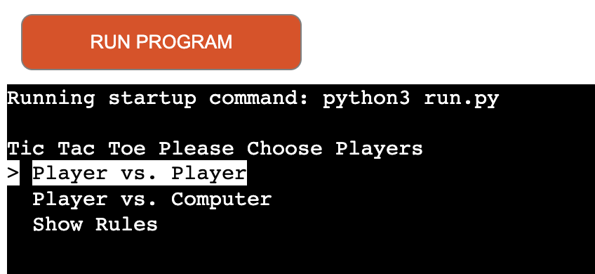
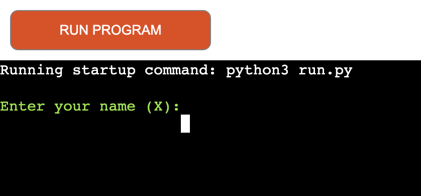
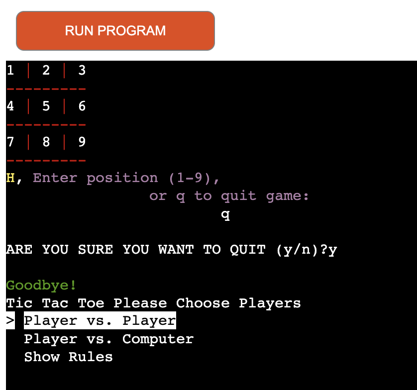
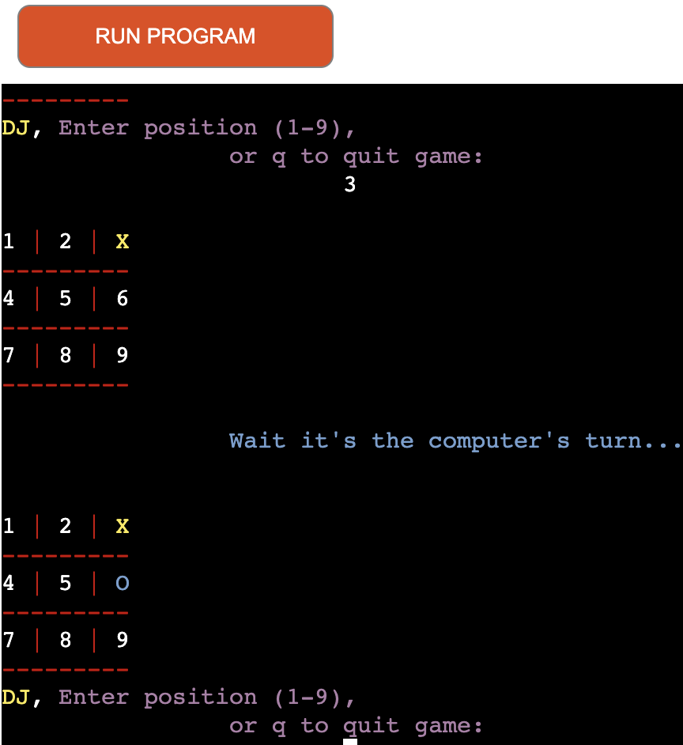
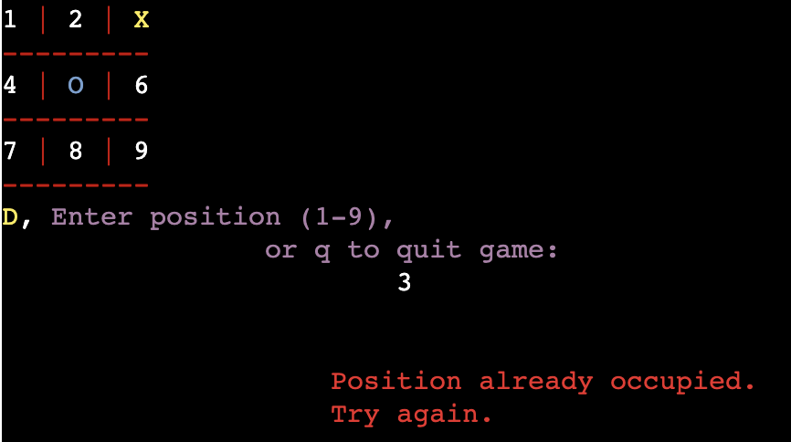
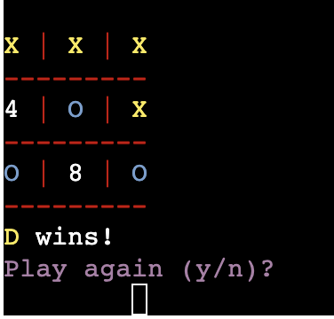
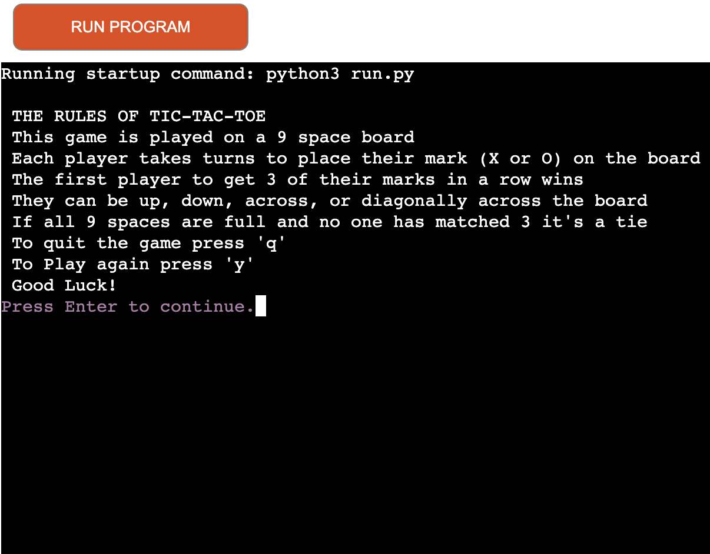
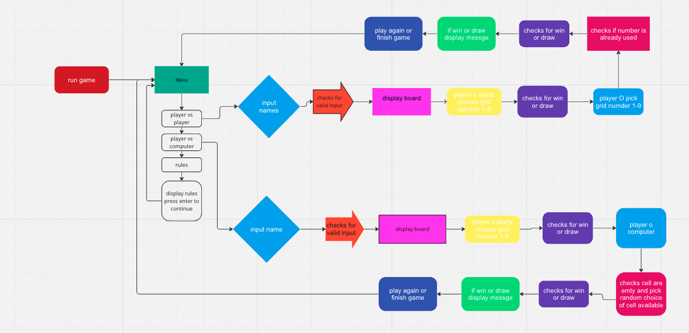

# TIC TAC TOE GAME
This is a game for player vs. player or player vs. computer each player gets a symbol either "X" or "O" to mark their position on the game board. The game is played on a 9 square grid (3X3). Each player has to try to get 3 of their symbols in a row This can be across, down or diagonally the first to achieve this wins the game. If none get 3 in a row it is a draw.
---

Link to App [Tic Tac Toe ](https://tic-tac-toe-pp3-3dc19c748ca1.herokuapp.com/)

# User stories
## As a player 
* I want to play a game that is clear and easy to understand for both young children and adults
* I want an easy-to-use menu
* I want to be able to navigate easily through options
* I want the option to quit the game 
* I want the option to play again
---
# Features
## A [simple_term_menu](https://pypi.org/project/simple-term-menu/) to give options for game mode and rules.

## Input name 

## Gives the option to quit

## checks for valid name input if invalid ask to try again.

## Option to play computer

## Checks if space is already occupied.

## Displays who won and gives the option to play again

## Displays Rules

# Technologies Used
[Am I responsive](https://ui.dev/amiresponsive) to create mockup design

# Languages:
* [Python](https://www.python.org/)
* [JavaScript](https://www.javascript.com/): Code Institute Template
* [HTML](https://html.com/): Code Institute template

# Libraries and Frameworks

## Imported Libraries
* [random](https://docs.python.org/3/library/random.html) For computers turn to choose a random number.
* [os](https://docs.python.org/3/library/os.html) To Clear screen.
* [time](https://docs.python.org/3/library/time.html?highlight=time#module-time) to create a delay in clearing the screen and computer answer.
* [colorama](https://pypi.org/project/colorama/) To add color to project.
* [simple_term_menu](https://pypi.org/project/simple-term-menu/) to create options menu.

---
# Flow Chart

---
# Deployment
This Project was deployed through [HEROKU](https://www.heroku.com/) using these steps:

1. Create a Heroku account 
2. Then select New
3. [Select Create new app](documentation/heroku-new.png)
4. Name the App, select region
5. [Select Create app](documentation/name_region.png)
6. [Then select Settings from the menu bar](documentation/setting.png)
7. [From here scroll down to Config Vars](documentation/config.png)
8. [Next add build packs for this project Python and nodejs were used](documentation/build_pack.png)
9. [Then go to Deploy in the menu bar](documentation/deploy.png)
10. [Choose GitHub then choose connect to github](documentation/deploy-method.png)
11. [Now enter repository name in search](documentation/name.png) 
12. [Then click connect](documentation/connect.png)
13. [From here scroll down and pick either automatic Deploy or manual deploy](documentation/update-deploy.png)
14. [The app is now been built](documentation/building.png)
15. [Once this has finished click view to go to app](documentation/deployed_success.png)

# Credits 
* [12 Beginner python projects](https://www.youtube.com/watch?v=8ext9G7xspg&t=2189s)
* [Corey Schafer](https://www.youtube.com/@coreyms) 
* [Slack Community](https://app.slack.com/) I use slack channels for guidance
* [W3Schools](https://www.w3schools.com/) was used as reference
* [Google](https://www.google.com/) was used throughout the project for reference.
* [Stack overflow](https://stackoverflow.com/) for information.

## Acknowledgements
I would like to acknowledge 
* [Code Institute](https://codeinstitute.net/)
* Juliia Konn My Mentor for her advice and support during the project. 