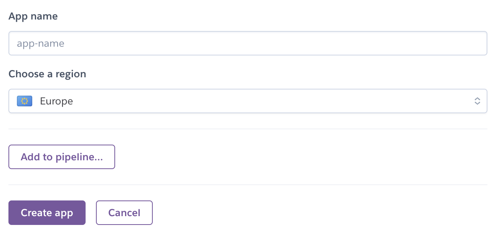
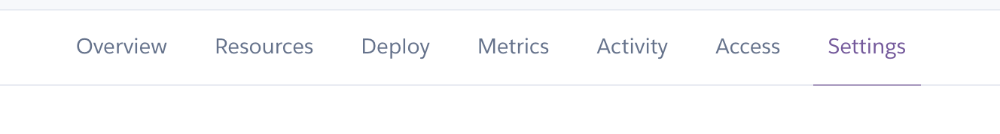
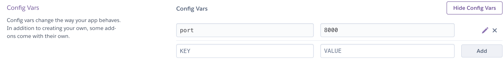
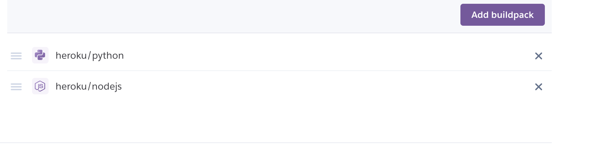
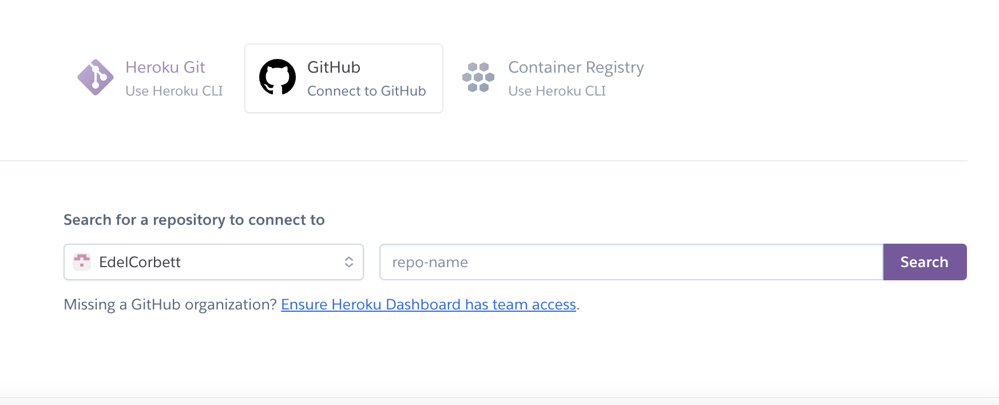
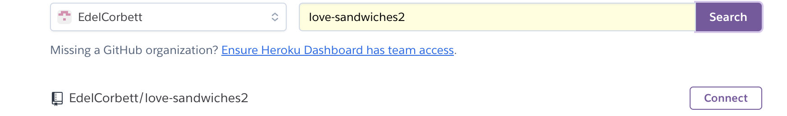
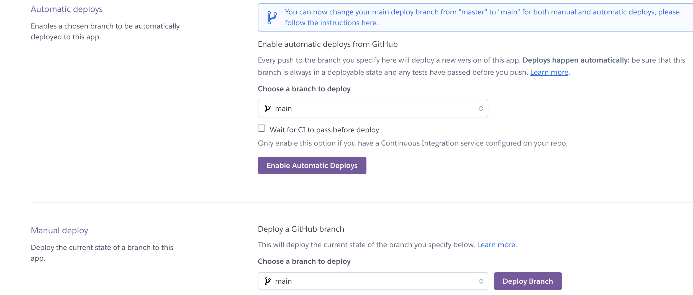
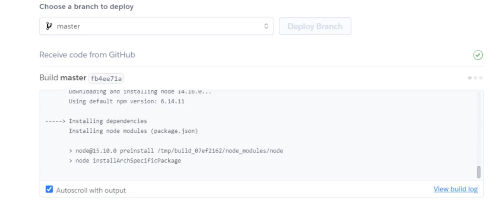
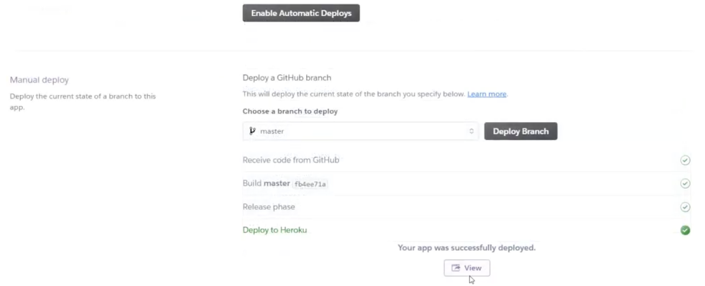

# TIC TAC TOE GAME
A board game for player vs player or player vs computer
---
![Mockups]

# Contents
* [USER STORIES](#USER)
* [FEATURES](#features)
* [Flowchart](#flow)
* [TECHNOLOGIES and LANGUAGES USED](#Technologies)
* [TESTING](#Testing)
* [BUGS](#Bugs)
* [DEPLOYMENT](#Deployment)
* [LIVE LINK FOR SITE](#LIVELINK)
* [CREDITS](#Credits)
---
# User stories
---
## As a player 
---
# Features
---
# Flow Chart

---
# Deployment
This Project was deployed through [HEROKU](https://www.heroku.com/) using these steps:

1. Create a heroku account 
2. Then select New
3. Select Create new app

4. Name the App, select region
5. Select Create app

6. Then select Settings from the menu bar

7. From here scroll down to Config Vars 

8. Next add buildpacks for this project python and nodejs was used

9. Then go to Deploy in menu bar

10. Choose github then choose connect to github

11. Now enter repository name in search
 
12. Then click connect

13. From here scroll down and pick either automatic Deploy or manual deploy

14. the app is now been built

15. Once this has finished click view to go to app 
